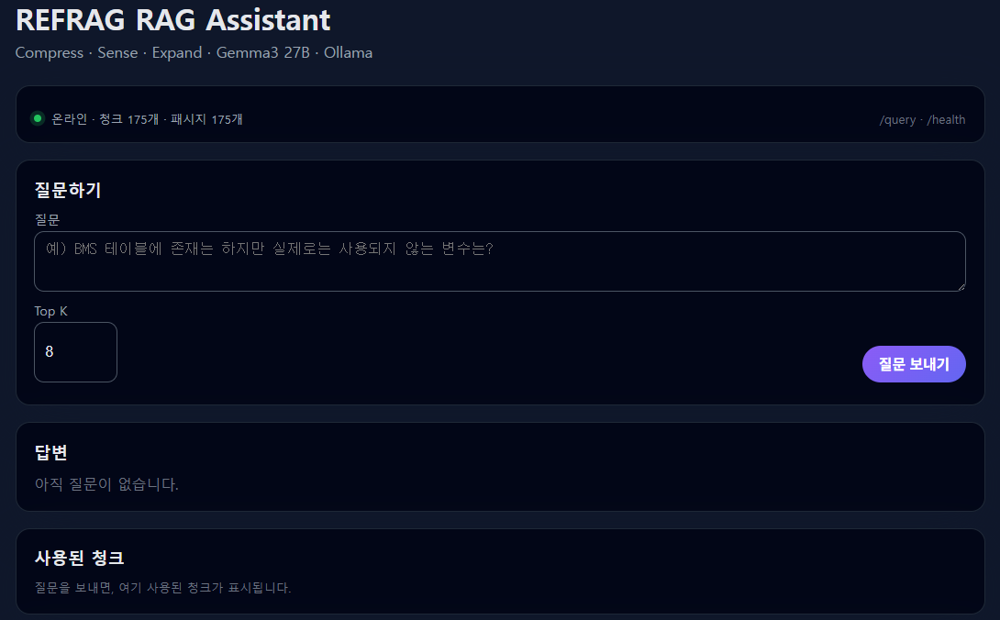
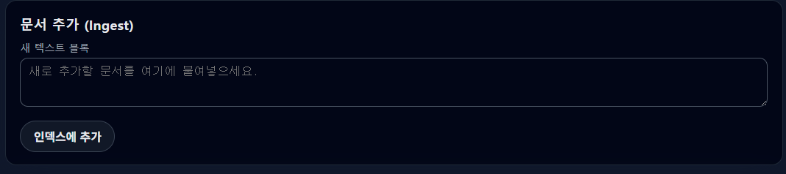
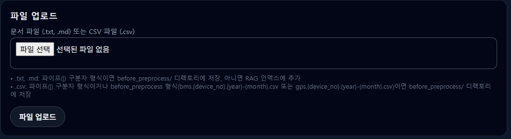
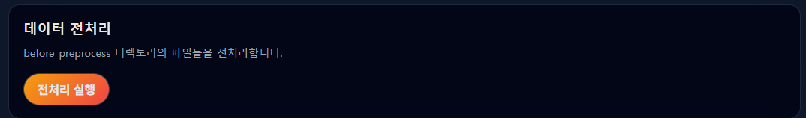
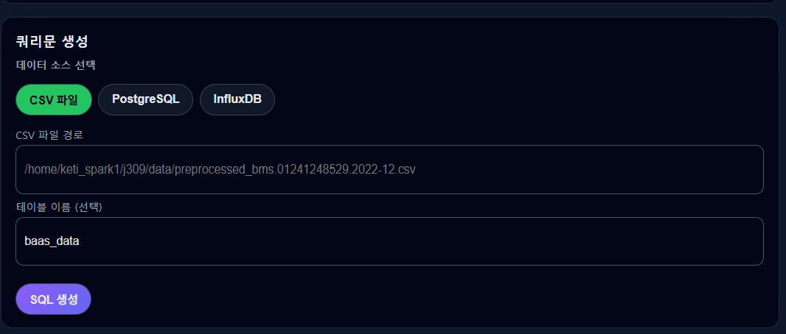

# 🔋 BaaS & EV Battery RAG Assistant (with REFRAG)

이 프로젝트는 전기차(EV) 배터리, BMS(Battery Management System), 그리고 BaaS(Battery as a Service) 도메인 지식 및 시계열 로그 데이터를 효율적으로 처리하기 위한 **지능형 RAG 시스템**입니다.

본 시스템은 **Gemma3 27B** 모델을 기반으로 하며, 최신 RAG 최적화 기법인 **REFRAG(Compress-Sense-Expand)** 아키텍처를 구현하여 정확도와 효율성을 동시에 확보했습니다.

---

## 🏗 시스템 아키텍처 및 코드 구조

`bass_rag/` 폴더 내의 주요 모듈은 다음과 같이 구성되어 있습니다:

- **`app/rag/`**: RAG 파이프라인의 핵심 로직
    - `pipeline.py`: **Retrieve -> Sense -> Compress/Expand -> Generate** 전체 흐름 제어.
    - `prompt_builder.py`: REFRAG 스타일의 프롬프트(압축/확장 컨텍스트 포함) 생성.
- **`app/compression/`**: REFRAG의 핵심인 'Sense' 단계 구현
    - `policy.py`: `HeuristicCompressionPolicy`를 통해 검색된 청크의 유사도 점수(Score)에 따라 `EXPAND`(전체 사용) 또는 `COMPRESS`(요약/부분 사용)를 결정.
    - `compressor.py`: 결정된 정책에 따라 텍스트를 실제로 압축하는 로직.
- **`app/llm/` & `app/embeddings/`**: 추상화된 클라이언트 인터페이스
    - `ollama_client.py`: Ollama를 통한 Gemma3 27B 모델 연동.
    - `st_client.py`: Sentence-Transformers를 이용한 로컬 임베딩 생성.
- **`app/index/`**: `vector_index.py`를 통해 FAISS 기반의 고속 벡터 검색 지원.
- **`app/utils/`**: 토크나이저, 레이턴시 측정, 캐싱 등 시스템 최적화 도구.

---

## ✨ 핵심 기능

### 1. REFRAG (Rethinking RAG based Decoding)
단순히 많은 문서를 LLM에 전달하는 방식에서 벗어나, 검색된 정보의 관련성을 스스로 판단합니다.
- **EXPAND**: 고득점 청크는 전체 내용을 프롬프트에 포함하여 정밀한 답변 유도.
- **COMPRESS**: 저득점/보조 청크는 핵심만 요약하여 토큰 사용량을 절약하고 LLM의 혼란 방지.

### 2. 배터리 도메인 특화 데이터 처리
- **전처리 (`preprocess_data.py`)**: BMS 로그와 GPS 데이터를 분석 가능한 형태로 자동 변환 및 정제.
- **도메인 지식 연동**: `rules/` 폴더 내의 BMS 사양서 및 차량 리스트를 참고하여 전문적인 변수 해석 지원.

### 3. 멀티 소스 하이브리드 검색
- **벡터 검색**: 문서의 의미론적 유사도 기반 검색.
- **SQL 도구 (`sql_tools.py`)**: CSV, PostgreSQL, InfluxDB 등 정형 데이터에 대한 직접적인 쿼리 및 분석 지원.

---

## 🚀 시작하기

### 환경 설정
```bash
# 가상환경 생성 및 패키지 설치
python3 -m venv venv
source venv/bin/activate
pip install -r requirements.txt
```

### 서버 실행
본 프로젝트는 두 가지 모드의 서버를 지원합니다:
1.  **일반 RAG 서버** (포트 8010): `uvicorn app.rag_server:app`
2.  **REFRAG 최적화 서버** (포트 8011): `uvicorn app.refrag_server:app`

---

## 📸 실행 화면 (UI Screenshots)

### 1. 데이터 관리 및 전처리
배터리 로그 데이터를 업로드하고, 시스템에서 분석 가능한 형태로 전처리하는 과정입니다.

| 데이터 파일 업로드 | 데이터 전처리 실행 |
|:---:|:---:|
|  |  |

### 2. 하이브리드 검색 및 쿼리 생성
문서 기반 검색뿐만 아니라, 데이터베이스(PostgreSQL, InfluxDB) 연동을 위한 SQL 쿼리 생성 기능을 지원합니다.

| 쿼리 생성 인터페이스 (1) | 쿼리 생성 인터페이스 (2) |
|:---:|:---:|
|  |  |

### 3. REFRAG 기반 지능형 질의응답
사용자의 질문에 대해 검색된 청크를 분석하고, 최적화된 답변을 생성하는 화면입니다.


*질문: "BMS 테이블에 존재하지만 실제로 사용되지 않는 변수는?"에 대한 답변 과정*

| REFRAG 상세 분석 (1) | REFRAG 상세 분석 (2) |
|:---:|:---:|
|  |  |

### 4. 시스템 모니터링 및 추가 화면
| 대시보드 화면 | 상세 로그 확인 |
|:---:|:---:|
|  |  |
|  |  |

---
**보고서 작성 및 README 생성 완료** (2025. 12. 23.)

